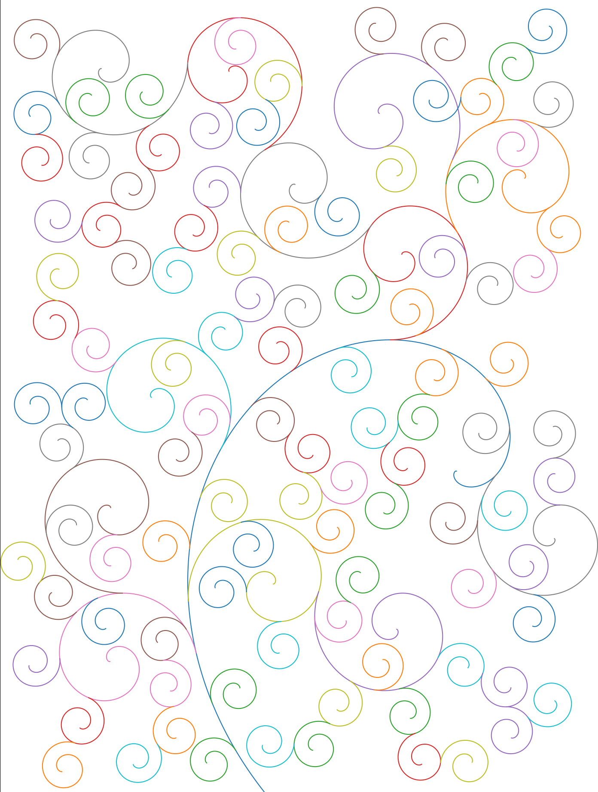

# Space Filling Curves based on Magnetic Particles

Based on the paper "Magnetic Curves: Curvature-Controlled Aesthetic Curves
Using Magnetic Fields" by Ling Xu and David Mould, I implemented their
algorithm, more or less.

There was a lot specifically *not* mentioned in their paper which was frustrating, but the end product looks close enough for my purposes.

## Examples




Compared with an image from their paper:


## Running it

```bash
python3 draw.py
xdg-open draw.png
```

## License

AGPLv3
